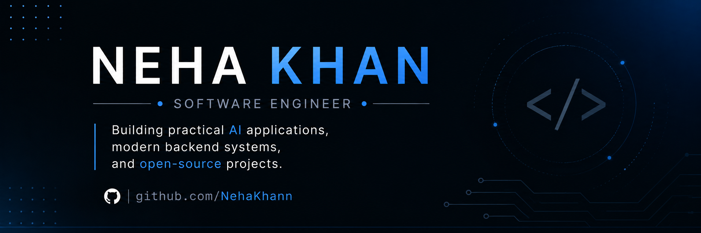

  

  
  
  

---

## 👋 About Me

I'm a Software Engineer with **4+ years of experience** building enterprise applications across banking and product-based environments.

Today, I'm focused on expanding into **AI Engineering** by building practical applications, contributing to open-source projects, and documenting my learning through technical writing.

I enjoy creating software that is reliable, maintainable, and solves real-world problems.

---

## 🚀 What I'm Building

- 🤖 AI-powered applications
- 🧠 LLM Engineering Learning Journey
- 🐍 Python Scraping Series (14 Days)
- 🛠️ Open-source projects
- ✍️ Technical articles on AI, Python, and Backend Engineering

---

## 📝 Latest Articles

- **Day 3:** Three Sites. All Blocked. Here's What I Actually Learned About Cloudflare.
- **Day 2:** How to Build a Book Price Tracker with Scrapy — And What Breaks Along the Way.
- **Day 1:** How to Scrape LinkedIn Job Postings with Python — No Selenium Required.
- **Claude Cowork Has Five Moving Parts. Most People Only Use One.**

➡️ **More articles on Medium**

---

## ⭐ Featured Projects

### 🛡️ SpringGuard

AI-assisted security auditing platform for Spring Boot applications.

**Tech**

`Java` • `Spring Boot` • `React` • `REST APIs`

---

### 🧠 LLM Engineering Learning Journey

Projects, notes, and experiments documenting my journey into AI Engineering.

**Focus**

`LLMs` • `Prompt Engineering` • `RAG` • `Python`

---

### 🐍 Python Scraping Series

A public 14-day series exploring production-style web scraping through real-world projects.

**Tech**

`Python` • `Scrapy` • `httpx` • `curl_cffi` • `Streamlit`

---

## 🧰 Engineering Toolbox

---

## 📚 Currently Exploring

- Large Language Models (LLMs)
- Retrieval-Augmented Generation (RAG)
- AI Agents
- MCP (Model Context Protocol)
- Vector Databases
- AI Application Architecture

---

## 📈 GitHub Activity

---

Building practical software • Learning in public • Always improving

