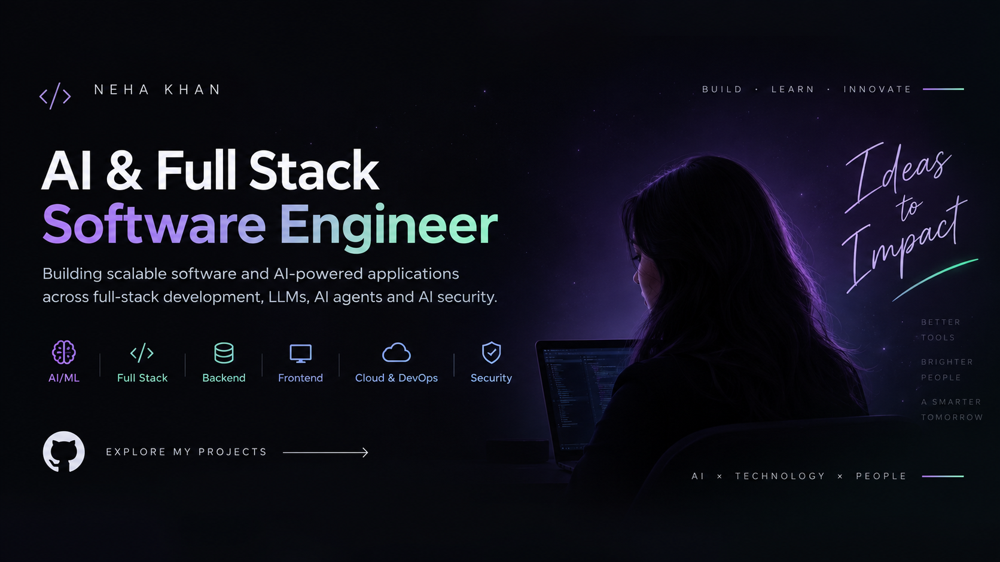

  

  
  
  

---

## 👋 About Me

🌐 **Portfolio:** [neha-khan-portfolio-gamma.vercel.app](https://neha-khan-portfolio-gamma.vercel.app/)

**AI Engineer | Full Stack Software Engineer** · Karachi, Pakistan

Full-stack software engineer with **4+ years of experience** building production systems in Java, JavaScript, and Python — across banking and product-based environments.

Currently focused on **LLM engineering** and **AI security** — applying the same engineering discipline I use in production systems to how I build and evaluate AI.

Open to full-stack & AI engineering roles.

---

## 🚀 What I'm Building

- 🤖 LLM applications & AI agents
- 🔎 RAG & prompt engineering
- 🎛️ Fine-tuning (LoRA / QLoRA / DoRA) & model evaluation
- 🛡️ AI security & LLM red-teaming (prompt injection, jailbreaks, garak scans)
- 🛠️ Full-stack apps in Python/FastAPI, Java/Spring Boot, and React/Next.js

---

## 📝 Latest Articles

- **I Compared LoRA vs DoRA** — DoRA Was Slower and Less Accurate. Here's Why.
- **LoRA Explained With Spreadsheets** — How to Train a Model Without Touching Its Weights.
- **How I Fit a Model That Shouldn't Fit on a 6GB Laptop GPU.**
- **From Gandalf to Garak** — Automating the AI Attacks I Used to Type by Hand.

➡️ **More articles on [Medium](https://medium.com/@n.nehakhan333)**

---

## ⭐ Featured Projects

| Project | Description | Link |
|---------|-------------|------|
| 🛡️ **MCP Trust Registry** | Live registry that scans and scores MCP tools for trustworthiness — rule engine + AI grading, verified in a network-blocked Docker sandbox | [Live](https://mcp-trust-registry.vercel.app) • [GitHub](https://github.com/NehaKhann/mcp-trust-registry) |
| 🔍 **SpringGuard** | Spring Boot/Java security auditor that grades code A–F with 100% deterministic scoring; AI only adds a labeled second opinion, never the grade | [Live](https://springguard-frontend.vercel.app) • [GitHub](https://github.com/NehaKhann/springguard-backend) |
| 💰 **Ledger — SME Cash-Flow Underwriting** | Turns raw bank transaction CSVs into audit-ready credit risk memos, with every risk metric computed deterministically and an LLM that only explains the numbers | [Live](https://cashflow-pi-liard.vercel.app) • [GitHub](https://github.com/NehaKhann/sme-cashflow-explainer) |
| 🧠 **AI Engineering Journey** | Hands-on curriculum covering LLM foundations, fine-tuning (LoRA/QLoRA/DoRA), quantization, RAG, and RLHF | [Repository](https://github.com/NehaKhann/ai-engineering-journey) |
| 🧙 **AI Security Labs** | Red-teaming LLMs with NVIDIA garak and a from-scratch Gandalf-style prompt injection challenge | [Garak](https://github.com/NehaKhann/ai-security-garak) • [Gandalf](https://github.com/NehaKhann/ai-security-gandalf) |

---

## 🧰 Engineering Toolbox

---

## 🎯 Focus Areas

- AI Engineering & LLM Fine-tuning (LoRA / QLoRA / DoRA)
- Retrieval-Augmented Generation (RAG)
- AI Security & Red-Teaming
- Full-Stack Development (Java/Spring Boot, Python/FastAPI, React/Next.js)
- Open Source

---

## 📈 GitHub Activity

---

Building practical software • Learning in public • Always improving

